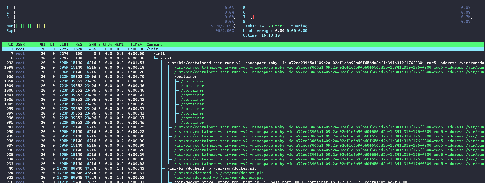
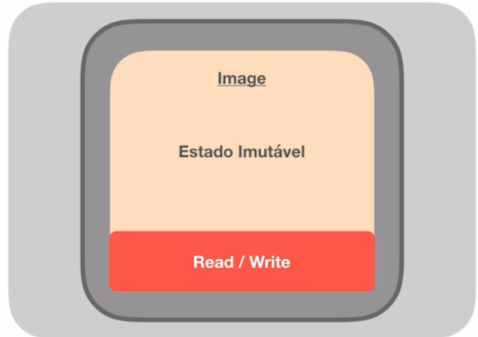
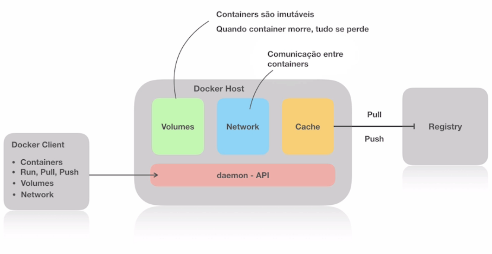

# Docker

Criação e administração de ambientes isolados.

**Summary:**

[O que é docker](#p01)

[Containers](#p02)

* [Namespace](#t01)
* [CGroups](#t02)
* [Overlay File System](#t03)
* [Conclusão container](#t04)

[imagens](#p03)

[dockerfile](#p04)

[Como o Docker funciona](#p05)

* [Cliente Docker](#t05)
* [Servidor Docker](#t06)
* [Imagens do Docker](#t07)
* [Registro do Docker](#t08)

[Observções](#p06)

<h2 id="p01">O que é o docker</h2>

o **Docker** é uma forma de virtualizar aplicações no conceito de “containers”, trazendo da web ou de seu repositório interno uma imagem completa, incluindo todas as dependências necessárias para executar sua aplicação.

<h2 id="p02">Containers</h2>

Para realmente entender o que é um container, primeiro precisamos entender: o sistema, os processos e os **três pilares de um container**.

<p id="t01"></>

1️⃣ **Namespace**

Com a evolução dos processos de um sistema, fez-se necessário a criação de uma solução para manter os processos sob controle. Assim surgiram os **namespaces**, uma maneira de isolar processos uns dos outros, utilizando um processo como pai e diversos outros como filhos, criando **processos em cascata** isolados por escopo.


Htop em um sistema linux evidenciando os processos em cascata

<p id="t02"></>

2️⃣ **CGroups**

Naturalmente processos muito grandes consomem muitos recursos e acabam atrapalhando outros processos, diante dessa necessidade foram criados os ****CGroups, **limitadores de recursos** do sistema para diferentes processos.

<p id="t03"></>

3️⃣ **Overlay File System**

Sistema de organização que trabalha em camadas guardando as diferenças de uma versão de sistema para outra em vez de um sistema completo, **se aproveita dos recursos do sistema operacional**, como o prório kernel e bibliotecas.

<p id="t04"></>

📦 Então, o que de fato é um **Container**?

Um container é um **namespace que emula um sistema** operacional **limitado por um controlador** de recurso (cgroup) que utiliza **recursos de organização em camadas para ser** **leve**.

<h2 id="p03">Imagens</h2>

Imagens no contexto de containers, trabalham com **camadas de dependências** e essas dependências podem ser **usadas em diversas outras imagens** (mesmo esquema de overlay file system) permite correções isoladas nos pedaços das imagens. Normalmente as imagens têm um nome e uma versão. As **imagens são imutáveis**, as aleracões são feitas em uma camada de escrita e leitura.



<h2 id="p04">Dockerfile</h2>

Usado para **construir imagens**, são definidas as dependências que precisamos para a aplicação, quais portas serão expostas e também as custimozações necessárias.

```docker
FROM debian:latest

# definir metadados à imagem
	# sintaxe -- >  <chave>=<valor>
LABEL maintainer="Vinícius Bittencourt <bittencourt1310@gmail.com>"
LABEL build_date="2022-01-12"

# códigos para customização da imagem
RUN apt-get update && apt-get upgrade -y
RUN apt-get install nginx -y

# expor portas
EXPOSE 80

# comando para iniciar o NGINX no Container
CMD ["nginx","-g","daemon off;"]
```

```bash
# para construir o Dockerfile
# no diretório do dockerfile 
docker build -t [tag] [caminho]
```

<h2 id="p05">Como o Docker funciona</h2>



<p id="t05"></p>

- **Cliente Docker**– o principal componente para criar, gerenciar e executar aplicativos em container. O cliente Docker é o principal método de controle do servidor Docker por meio de uma ILC, como Prompt de Comando (Windows) ou Terminal (macOS, Linux).

<p id="t06"></p>

- **Servidor Docker**– também conhecido como o daemon do Docker. Ele aguarda as solicitações da API REST feitas pelo cliente Docker e gerencia imagens e containers.

<p id="t07"></p>

- **Imagens do Docker**– instrua o servidor Docker com os requisitos sobre como criar um container Docker. As imagens podem ser baixadas de sites como **[Docker Hub](https://hub.docker.com/)**. A criação de uma imagem personalizada também é possível — para isso, os usuários precisam criar um Dockerfile e passá-lo para o servidor. Vale a pena notar que o Docker não limpa nenhuma imagem não utilizada, então os usuários precisam **[excluir dados de imagem](https://www.hostinger.com.br/tutoriais/como-usar-unzip-linux/)** eles mesmos, antes que acabe com muitas delas.

<p id="t08"></p>

- **Registro do Docker**– um aplicativo do lado do servidor de código aberto usado para hospedar e distribuir imagens do Docker. O registro é extremamente útil para armazenar imagens localmente e manter controle total sobre elas. Como alternativa, os usuários podem acessar o Docker Hub mencionado acima – o maior repositório mundial de imagens do Docker.

<h2 id="p06">Observções</h2>

- Existem duas maneiras de se construir uma imagem, por dockerfile ou por commit.
- As imagens são guardadas em um **Image Registry**, repositório de imagens.
    - O FROM no dockerfile faz um **pull** nesse repositório
    - O build faz um **push**