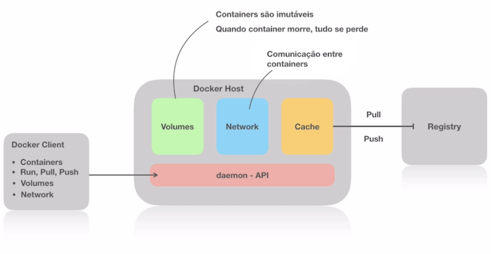

# Basic concepts

<h2 id="p01">What is Docker?</h2>

**Docker** is a way to virtualize applications in the concept of "containers", bringing a complete image from the web or its internal repository, including all the dependencies necessary to run your application.

<h2 id="p02">Containers</h2>

To really understand what a container is, we first need to understand: the system, the processes and the **three pillars of a container**.

<p id="t01"></>

1️⃣ **Namespace**

With the evolution of the processes of a system, it was necessary to create a solution to keep the processes under control. Thus came the **namespaces**, a way to isolate processes from each other, using a process as a parent and several others as children, creating **cascading processes** isolated by scope.

<div align="center">
    

Htop on a linux system showing cascading processes

</div>

<p id="t02"></>

2️⃣ **CGroups**

Naturally, very large processes consume a lot of resources and end up disturbing other processes. In view of this need, CGroups were created, **resource limiters** of the system for different processes.

<p id="t03"></>

3️⃣ **Overlay File System**

Organizational system that works in **layers keeping the differences** from one version of the system to another instead of building up a complete system, it takes advantage of the resources of the operating system, such as the kernel itself and libraries.

<p id="t04"></>

📦 So what actually is a **Container**?Tudo isso para ser **rápido** e **leve**.

* A container is a **namespace that emulates an operating system**
* It is **constrained by resource controllers**
* And utilizes **layering capabilities**
* All this to be **fast** and **lightweight**.

<h2 id="p03">Images</h2>

Images in the context of containers, work with **layers of dependencies** and these dependencies can be used in several other images.
Images usually have a name and version. The **images are immutable**, the changes are made in a read and write layer.
So you can **stack up images** and **make isolated corrections** in pieces of images.

<div align="center">
    
</div>

<h2 id="p04">Dockerfile</h2>

Used to **build images**, the dependencies we need for the application are defined, which ports will be exposed and also the necessary customizations.

```dockerfile
FROM debian:latest

# set metadata to image
# syntax --> <key>=<value>
LABEL maintainer="Vinícius Bittencourt <bittencourt1310@gmail.com>"
LABEL build_date="2022-01-12"

# image customization commands
# in this case we are installing nginx
RUN apt-get update && apt-get upgrade -y
RUN apt-get install nginx -y

# expose ports
EXPOSE 80

# command to start NGINX inside the container
CMD ["nginx","-g","daemon off;"]
```

```bash
# terminal command to build the Dockerfile
docker build -t [tag] [dockerfile directory path]
```

<h2 id="p05">How Docker works</h2>

<div align="center">
    
</div>

<p id="t05"></p>

* **Docker Client** – The main component for building, managing and running containerized applications. The Docker client is the primary method of controlling the Docker server through a CLI such as Command Prompt (Windows) or Terminal (macOS, Linux).

<p id="t06"></p>

* **Docker Server**– also known as the Docker daemon. It listens for REST API requests made by the Docker client and manages images and containers.

<p id="t07"></p>

* **Docker Images** – Instruct the Docker server with requirements on how to create a Docker container. Images can be downloaded from sites like **[Docker Hub](https://hub.docker.com/)**. Creating a custom image is also possible — for this, users need to create a Dockerfile and pass it to the server. It's worth noting that Docker doesn't clean up any unused images, so users need to **delete image data** themselves before it wipes out too many of them.

<p id="t08"></p>

* **Docker Registry** – An open source server-side application used to host and distribute Docker images. Registry is extremely useful for storing images locally and maintaining full control over them. Alternatively, users can access the aforementioned Docker Hub – the world's largest repository of Docker images.

<h2 id="p06">Comments</h2>

* There are two ways to build an image, by dockerfile or by commit.
* Images are stored in an **Image Registry**, local image repository.
* When we use FROM debian:latest in the dockerfile, we are actually **pulling** the debian repository